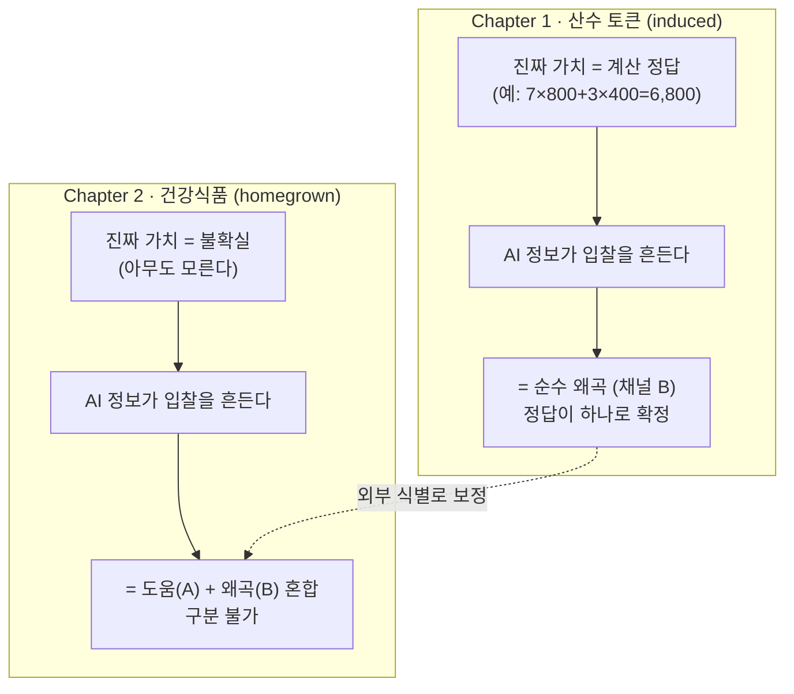
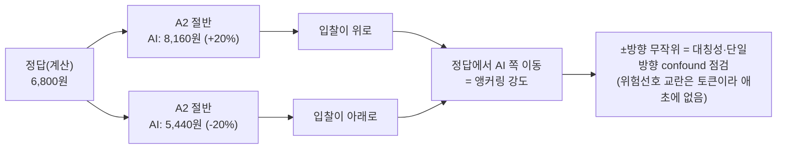

# AI 정보와 가치판단 — 연구 프로포절 (v7)

> [!abstract] 초록 (한 줄 요약)
> **AI가 알려주는 정보는 사람들의 "값 매기기"를 *돕는가, 망치는가* — 그리고 그 효과의 *성격*은 *진짜 값을 알 수 있느냐(계산으로 앎) 없느냐(credence)*에 따라 달라지는가?** 정답이 있는 *산수 토큰 실험*(Chapter 1)과 정답이 없는 *건강식품 실험*(Chapter 2), 둘로 나눠 검증한다.

> [!info] 읽는 법 — 항목마다 깊이가 3단계로 중첩됨
> 각 항목은 **펼칠수록 전문적**이 된다. 들여쓰기 단계 = 독자 수준.
> - `•` **일반인** (전문용어 없음) / `  ◦` **학부생** (개념+골격) / `    ▪` **대학원생** (식별·방법·이론, 수식 없이 말로)
> 구성: **1 서론 → 2 선행연구 → 3 이론 → 4 실험 설계 → 5 분석 전략 → 6 기대 기여 → 7 한계 → 8 결론**

---

## 1. 서론 (Introduction)

### 1.1 배경·동기

- **AI 추천이 일상으로 들어왔다. "이거 사세요", "이게 당신에게 맞아요"를 매일 듣는다.**
    - 수억 명이 ChatGPT 같은 도구를 쇼핑·건강·금융 결정에 쓴다. 그런데 그 조언이 **언제 도움이고 언제 위험한지**는 아직 잘 모른다.
        - 소비자 후생·정책 평가는 지불의사(WTP) 추정에 의존하는데, AI가 그 측정 자체를 바꾸기 시작했다. *진짜 돈이 걸린(유인적합) 환경에서 AI 정보가 valuation을 어떻게 움직이는지*에 대한 실험 증거는 사실상 없다(메타분석 163편 중 0편).
- **식품·건강 영역은 이 질문을 던지기에 이상적이다.**
    - 건강식품은 효능을 사보기 전엔 모르고, AI 맞춤 추천이 실제 서비스로 존재한다.
        - credence good → 채널 A(불확실성 감소) 작동 조건 충족; 진짜 가치를 *알 수 없는*(unknowable) 대표 사례 — Ch1의 토큰(knowable)과 대비.

### 1.2 핵심 퍼즐 — AI의 양면성

- **AI는 도움도 되고 휘둘리게도 만든다 — 어느 쪽이 이길지가 불분명하다.**
    - **도움 채널:** 정보 → 불확실성 ↓ → 더 정확한 값. **왜곡 채널:** AI 숫자 앵커링 / 정보 과부하 / 무비판 수용 → 값이 휘어짐.
        - 두 통념 충돌: Logg(2019, appreciation) ↔ Dietvorst(2015, aversion) ↔ Corrigan(2012, 정보가 demand revelation 악화). 두 채널은 **관측적으로 등가**할 수 있어 단일 실험으론 분리 곤란 → **산수 토큰(채널 B만)과 건강(A+B)을 분리**하는 것이 핵심 동기.

### 1.3 연구 질문

- **AI가 "이건 얼마쯤이에요"라고 알려줄 때, 그게 값 매기는 판단을 도와줄까 휘둘리게 만들까?**
    - AI 정보가 **지불의사(WTP)** 형성을 *돕는가(정확한 가치 발견)* 왜곡하는가(앵커링·과의존)? 그 방향은 **과제 성격**·**인지능력**에 따라 어떻게 달라지나?
        - 유인적합 elicitation에서 AI 효과를 측정하고, **value knowability에 따라 AI 효과의 성격이 갈리는지**(Ch1 knowable vs Ch2 unknowable)를 검정.

**표 1-1. 챕터별 핵심 질문**

| 구분 | 질문 (일반어) | 무엇을 식별 |
|---|---|---|
| Ch1 (산수 토큰) | 정답이 정해진 과제에서 AI 맞는/틀린 정보가 입찰을 얼마나 흔드나? | 순수 왜곡(채널 B), 인지능력 조절 |
| Ch2 (건강식품) | AI 개인화 정보가 "설문값–경매값 갭"을 줄이나 키우나? | 가상편의 변화(채널 A+B) |
| 통합 | 두 과제에서 AI 효과의 *성격*이 갈리나? | value knowability (knowable vs unknowable) |

### 1.4 기여 미리보기

- **"AI는 계산 못 하는 사람을 가장 돕고 동시에 가장 오도하며, 그 순효과의 방향은 과제가 개인적이냐에 달려 있다."**
    - ① 유인적합 valuation서 AI 효과 최초 실증 ② value knowability에 따른 효과 구조 차이(Ch1 왜곡-only vs Ch2 도움-or-왜곡) ③ AI×인지능력 이질성 ④ 알려진 가치 기준 앵커 정량화. (상세 §6)

---

## 2. 선행연구 (Related Literature)

- **Logg, Minson & Moore (2019) — "사람들은 AI 조언을 더 따른다"(appreciation)**
    - 같은 조언이라도 "알고리즘이 했다"면 더 받아들인다.
        - *OBHDP* 151:90–103. WOA d=0.32–0.44. 단 비교 대상이 *자기 자신*이면 약화 — 경매=자기판단이라 보수적 상한.
- **Dietvorst, Simmons & Massey (2015) — "AI 실수를 보면 등 돌린다"(aversion)**
    - AI가 한 번 틀리면 사람보다 더 가혹하게 외면.
        - *JEP:General* 144(1):114–126. 65%→23%. → Pre_Aversion 근거. (appreciation은 default, 오류 관측 후 aversion — Logg 본인 reconciliation, 맥락 의존.)
- **Lee, Nayga, Deck & Drichoutis (2020) — "머리 좋은 사람이 경매를 더 정확히"**
    - 계산 능력이 낮으면 정답(진짜 가치)에서 더 벗어난다.
        - *AJAE* 102(5):1494–1510. **RSPM**·induced SPA. 완전계시 고 29.4% vs 저 13.4%. → **Ch1 직접 템플릿**("분산 3배"는 근거 없음, 정정).
- **Fox et al. (1998, CVM-X) — "설문 값이 진짜보다 부풀려진다"**
    - 설문 WTP는 경매 WTP보다 크다; 경매로 부풀림을 보정.
        - *AJAE* 80(3):455–465. 보정계수 0.55–0.86. 정보(견학)가 입찰 이동. → **Ch2 앵커 논문**.
- **Spatharioti et al. (2023) — "LLM이 맞으면 도움, 틀리면 과의존"**
    - AI 검색이 정확하면 결정이 좋아지지만 틀린 정보엔 그대로 따라가 망친다.
        - arXiv:2307.03744(Microsoft, preprint). 정상 95% vs 92%, 오류 **47% vs 93%**; confidence 하이라이트로 26%→58% 완화. → **A1/A2 실증 동형 + mitigation arm 후보**(비유인·비실화폐·인지능력無).
- **Corrigan et al. (2012) — "정보를 줬더니 더 틀리더라"**
    - 경매 중 가격 정보가 진짜 가치에서 더 멀어지게 한다.
        - *AJAE* 94(1):97–115. → 편향 AI 메커니즘 + **no-feedback 설계 근거**.
- **List (2001) — "전문가는 외부 신호에 안 흔들린다"**
    - 경고(cheap talk)가 초보자 과장은 줄이지만 딜러엔 무효.
        - *AER* 91(5):1498–1507. → AI도 *저지식·저인지*에 더 크게 작동(이질성).
- **Jacquemet et al. (2013) — "선서가 정직한 입찰을 끌어낸다"**
    - 진실 서약이 과장과 거짓 0원 응답을 동시에 줄인다.
        - *JEEM* 65(1):110–132. **동일 메커니즘으로 induced+homegrown 병렬** = 본 2-chapter 구조의 가장 가까운 설계 선례.
- **Choi et al. (2018) — "라벨 하나가 값을 크게 바꾼다(한국)"**
    - 등급 정보를 주면 WTP가 뛰지만 상세 설명은 추가 효과가 거의 없다.
        - *CJAE* 66(3):511–531. 한국·random nth-price·식품. → **Ch2 한국 템플릿** + dose-response prior(단순>상세).
- **Bockstedt & Buckman (2025) — "보상이 걸리면 사람을 더 믿는다"**
    - 성과 보상이 있으면 AI가 더 나아도 사람에게 맡기려 한다.
        - *Management Science* 72(1):323–342. → Pre_Aversion / 유인 하 appreciation 약화 경고.
- **Plott & Zeiler (2005) — "절차를 고치면 갭이 사라진다"**
    - WTP-WTA 갭은 훈련·익명 같은 절차로 켜고 끌 수 있다.
        - *AER* 95(3):530–545. induced/lottery는 *분석 안 한* paid practice였음(fn15) → Ch1이 induced를 *분석*하는 건 PZ를 넘어선 확장.
- **Shogren et al. (2001) — "모두를 입찰에 참여시키는 경매"**
    - 무작위로 정해지는 가격 덕에 낮게 부른 사람도 매번 참여 동기.
        - *JEBO* 46:409–421. → **메커니즘 근거**(off-margin 재참여).
- **방법론 보조 (메커니즘·이론)**
    - 음수입찰·운영·위험·commitment cost 표준들.
        - Lee & Fox(2015) 음수입찰→WTP 프레임; Canavari(2019, *ERAE*) 운영·power·BDM lottery 부적합; Bergman(2010) CRT×앵커링 n.s.; Zhao & Kling(2001) commitment cost; Haaland et al.(2023, *JEL*) 정보제공 실험 설계서.

---

## 3. 이론적 프레임워크 (Conceptual Framework)

### 3.1 가상편의와 두 채널

- **가상편의 (Chapter 2 전용)** — 설문으로 물은 WTP는 진짜 경매 WTP보다 부풀려진다.
    - 가상편의(갭) = 설문에서 부른 값에서 경매에서 부른 값을 뺀 차이.
        - 원인: 가상 상황 → 예산·참여 제약 부재 → 과장. Fox CVM-X 보정계수 0.55–0.86. K-R 논쟁과는 *별개 phenomena*로 demotion.
- **채널 A — Bayesian 가치 발견 (Ch2 전용, 갭 감소)** — AI로 불확실성이 줄면 진짜 가치에 가깝게 입찰.
    - AI → 불확실성 ↓ → 경매 입찰이 진짜 가치로 수렴 → 갭 감소.
        - 경매가 설문보다 더 크게 반응한다는 비대칭을 별도로 검정(SUR). Zhao–Kling commitment cost가 뒷받침(아는 가치엔 비용≈0, 모르는 가치엔 양수).
- **채널 B — 행동경제 왜곡 (양 챕터 공통)** — 끌리거나, 헷갈리거나, 무비판 수용.
    - B-1 앵커링 / B-2 정보 과부하 / B-3 appreciation·aversion.
        - **Ch1은 진짜 가치가 고정 → 채널 A 부재 → B를 순수 측정.** B-1=의식적 참조, B-3=무의식적 프레임 수용으로 구분.

### 3.2 통합 프레임 — 진짜 가치를 알 수 있느냐 (value knowability)

- **AI의 효과는 "그 값을 원래 알 수 있느냐"에 따라 갈린다.**
    - 값을 *알 수 있으면*(토큰) AI는 발견을 도울 수 없고 **왜곡만** 가능. 값을 *모르면*(건강식품) AI가 **진짜로 정보를 줄 수도, 왜곡할 수도** 있다.
        - Ch1(knowable) = 채널 B 단독; Ch2(unknowable) = 채널 A+B. 두 챕터의 AI 효과는 *성격이 다르다*(Ch1 순수 왜곡 vs Ch2 도움-or-왜곡) — 이것이 설계가 직접 만드는 통합 축. (심리 메타분석에서 빌린 프레임이 아니라 *조작하는 차원*이라 방어가 쉽다.)

**표 3-1. 두 과제의 구조적 대비 (value knowability)**

| 차원 | **Ch1 산수 토큰 (knowable)** | **Ch2 건강식품 (unknowable)** |
|---|---|---|
| 진짜 가치 | 계산하면 앎 (결정론) | 아무도 모름 (credence) |
| AI가 할 수 있는 것 | **왜곡만** (발견 불가) | 정보 제공(A) **또는** 왜곡(B) |
| 작동 채널 | **B 단독** | **A + B** |
| 핵심 질문 | 얼마나·누가 왜곡되나 | 갭을 줄이나 키우나 |

> [!note] 배경 — AI 신뢰는 맥락 의존적
> 사람들은 때로 알고리즘을 과신하고(Logg 2019, appreciation), 오류를 본 뒤엔 외면한다(Dietvorst 2015, aversion). 본 연구는 *유인적합 가치평가*에서 어느 쪽이 지배하는지를, **value knowability와 인지능력**에 따라 본다. 인지능력 조절: 저인지=System 1(과부하·앵커링), 고인지=System 2(저항); Bergman(2010) CRT×앵커링 n.s. → 탐색적.

### 3.3 가설

- **큰 그림: AI 효과의 *성격*이 value knowability에 따라 갈린다.**
    - Ch1(값 knowable)에서 AI는 *가치 발견 불가* → 효과는 채널 B(왜곡) 중심; Ch2(값 unknowable)에서는 *진짜 정보 제공(채널 A) 또는 왜곡(채널 B)*.
        - **H1(Ch1):** 정확 AI는 정답 이탈을 줄이고, 편향 AI는 늘리며 입찰을 AI 숫자 쪽으로 끈다.
        - **H2(Ch2):** AI·정보량이 가상편의를 줄이되, AI×고정보에선 채널 B가 지배해 갭이 오히려 커질 수 있다.
        - **H3(인지, 탐색):** 저인지능력에서 AI 효과(도움·왜곡 모두)가 더 크다.
        - **H4(통합):** AI 효과의 *성격*이 value knowability에 따라 갈린다 — Ch1(knowable)에서는 *가치 발견 불가* → 채널 B(왜곡) 중심, Ch2(unknowable)에서는 *도움(채널 A) 또는 왜곡(채널 B)*. Ch1은 Ch2의 왜곡 채널을 분리해 해석을 돕는다(cross-calibration).

---

## 4. 실험 설계 (Experimental Design)

### 4.1 설계 개요 — 두 실험으로 분리 (2-chapter)

- **정답이 있는 산수 토큰 실험과 정답이 없는 건강식품 실험, 둘로 나눠 본다 (서로 다른 사람들).**
    - between-subject 분리: 한 실험의 AI 인상이 다른 실험으로 새는 오염 차단. 단 **한 모집단에서 동시 수집**해 비교 가능하게.
        - **ADR-011:** induced에 AI를 넣어 채널 B를 순수 측정하려면 within-subject 시 induced 앵커가 homegrown으로 carryover → 앵커링 측정 훼손. 같은 모집단 stratified randomization → 두 실험 AI 효과 비교 가능(cross-calibration). 한 피험자 = 한 챕터.

**표 4-1. 두 챕터 한눈 비교**

| 항목 | **Chapter 1 — 산수 토큰 (induced)** | **Chapter 2 — 건강식품 (homegrown)** |
|---|---|---|
| 진짜 가치 | **알려짐** (계산 정답값, 결정론) | **모름** (credence good) |
| AI 효과 해석 | 순수 왜곡(채널 B만) | 도움+왜곡(채널 A+B) |
| 주 측정 | 입찰이 정답에서 벗어난 정도 | 가상편의(설문–경매 갭) |
| 처치 | 3-arm (없음/정확/편향) | 5-arm (정보원×정보량+기준) |
| 핵심 식별 장치 | 결정론적 정답 대비 앵커 추종(위험 없음) | SUR 비대칭 + filler + AnchorDev |
| value knowability | knowable (정답 앎) | unknowable (credence) |
| 직접 선행 | Lee et al. (2020) | Fox et al. (1998) CVM-X |
| 역할 | 채널 B를 외부에서 식별 → Ch2 보정 | 현실 WTP·정책 함의 |

### 4.2 Chapter 1 — 결정론적 산수 토큰 (induced value)

> [!tip] 이 절의 핵심 한 줄
> 토큰의 값은 **계산하면 나오는 결정론적 정답**(예: 7×800 + 3×400 = 6,800원)이다. 운·위험이 없으니 정답이 하나로 확정되고, AI 때문에 입찰이 그 정답에서 흔들리면 그건 *순수한 왜곡*이다 — AI의 "왜곡 채널"을 깨끗하게 떼어내는 장치.
> *〔ADR-011 Amendment 2026-06-01: 구 "복권" 설계를 토큰으로 교체. 복권은 정답이 EV가 아니라 위험선호에 따른 CE라 "이탈=왜곡"이 성립 안 함 — 토큰은 위험이 없어 이 문제를 제거한다.〕*

#### 큰 그림 — 왜 토큰이 "왜곡"을 깨끗하게 보여주나

- **토큰은 정답이 하나로 정해지고, 건강식품은 정답이 없다. 그 차이가 핵심이다.**
    - 토큰에서 AI가 입찰을 정답에서 밀면 = *순수 왜곡*. 건강식품은 *도움+왜곡*이 섞여 구분이 안 된다.
        - Ch1은 채널 B 단독 식별 → Ch2의 "채널 A vs B 등가성" 문제를 외부에서 보정. (토큰은 불확실성 0 → 채널 A 자체가 부재 → 더 깨끗.)

#### 왜 복권이 아니라 토큰인가

- **복권은 "정답"이 사람마다 다르다(겁 많으면 낮게 쓰는 게 정답). 토큰은 정답이 하나다.**
    - 복권의 합리적 입찰은 위험선호에 따른 *확실성등가(CE)* 라 연구자가 모르고 사람마다 다름 → "EV에서 벗어남 = 왜곡"이 거짓. 토큰은 위험이 없어 정답=계산값 하나.
        - 이 한 수가 (i) 위험선호 교란, (ii) nth-price 유인적합성(결정론적 good → Vickrey 성립), (iii) Lee 2020(결정론 토큰) positive control 정합을 **동시에 해결**. *계산은 여전히 필요*하므로 AI 계산보조 의미 유지(산술 항 수로 난이도 조절). 선례: Spatharioti(2023)의 "정답 있는 결정론적 계산 과제".

#### 구체 예시 — 토큰 하나로 따라가기

- **예: "빨강 칩 7개(개당 800원) + 파랑 칩 3개(개당 400원)" 토큰. 계산하면 6,800원.**
    - 정답은 6,800원 하나(운·위험 없음). AI가 옆에서 숫자를 불러준다.
        - 정답 = 6,800원으로 **확정**. AI가 맞는 값/틀린 값을 줄 때 입찰이 정답에서 어디로 가는지가 곧 "왜곡"의 측정.

**표 4-2. 구체 예시 — 정답 6,800원짜리 산수 토큰**

| 조건 | AI가 말하는 값 | 정답(계산) | 합리적 입찰 | 관측될 입찰(예측) |
|---|---|---|---|---|
| **A0** 통제 | (없음) | 6,800 | 6,800 | 6,800 근처, **저인지일수록 계산 틀려 흩어짐** |
| **A1** 정확 | 6,800 | 6,800 | 6,800 | 6,800에 **더 수렴**(저인지서 개선 큼) |
| **A2** +20% | 8,160 | 6,800 | 6,800 | 6,800보다 **위로**(8,160 쪽) |
| **A2** −20% | 5,440 | 6,800 | 6,800 | 6,800보다 **아래로**(5,440 쪽) |

> [!note] 핵심 포인트
> 정답이 6,800원 **하나로 확정**돼 있으니, 입찰이 거기서 AI 숫자 쪽으로 움직이면 곧 앵커링이다. 복권과 달리 "위험회피라서 낮게"가 끼어들 여지가 **없다** — 이게 토큰 전환의 핵심 이점.

#### 처치 — AI 3-arm

- **AI 없음 / AI가 맞는 값 / AI가 틀린 값(±20%, 방향 무작위).**
    - 정확 AI = "도움이 되나?", 편향 AI = "끌려가나?"를 본다.
        - between-subject, 인지능력(RSPM) 층 내 무작위 배정. 편향 arm의 ±20% 방향 무작위는 앵커링 대칭성 점검용.

**표 4-3. Chapter 1 처치 3-arm**

| Arm | AI 처치 | AI가 주는 내용 | 측정 의도 |
|---|---|---|---|
| **A0** 통제 | 없음 | — | 기준선 (인지능력별 정답 이탈) |
| **A1** 정확 | 있음 | *올바른* 계산 정답값 | AI가 계산을 **돕나** |
| **A2** 편향 | 있음 | 정답값 **±20%**(방향 무작위) | AI 숫자에 **끌려가나**(앵커링) |

#### 설계 격자 — AI 3종 × 인지능력 2층 (6셀)

- **AI 처치 3가지를, 머리 셈 빠른 사람/아닌 사람으로 다시 나눈다.**
    - 같은 AI라도 인지능력에 따라 효과가 다른지 본다.
        - AI(3) × 인지능력(고/저) = **6셀**. 인지능력 축은 무작위가 아니라 *측정·층화*(관찰적) → 탐색적 보고.

**표 4-4. 설계 격자 (6셀)**

| 인지능력 (RSPM) | A0 통제 | A1 정확 | A2 편향 |
|---|---|---|---|
| **고** (System 2) | 셀 1 | 셀 3 | 셀 5 |
| **저** (System 1) | 셀 2 | 셀 4 | 셀 6 |

- **왜 RSPM인가** — 계산이 약한 사람이 AI에 더 휘둘리고 더 도움도 받을 것이다.
    - 비언어 추론력(RSPM, 도형 패턴 맞히기)으로 측정.
        - **Lee(2020)와 같은 도구(RSPM) + 같은 good 유형(결정론 토큰)** → 외부 벤치마크 비교가 정확히 성립. 검정력 위해 연속변수 권장.

#### 핵심 식별 — 앵커링을 어떻게 재나 (위험선호 문제 없음)

- **정답이 하나라 식별이 단순하다.** 입찰이 정답(6,800)에서 AI 숫자 쪽으로 간 정도 = 앵커링.
    - ±20%를 +/− 무작위로 주는 건 *위험선호 분리*(이젠 불필요) 목적이 아니라 **앵커링이 위/아래 대칭인지·단일방향 confound가 없는지** 점검용.
        - 〔구 복권 설계의 "위험선호 직교화"는 토큰 전환으로 불필요 — 위험 자체가 없음.〕

**표 4-5. 왜 토큰이 복권보다 깨끗한가**

| 항목 | 복권 (구 설계) | **결정론적 토큰 (현 설계)** |
|---|---|---|
| 정답 | 사람마다 다름 (CE, 위험선호) | **하나로 확정** (계산값) |
| 이탈 = 왜곡? | ✗ 위험선호 섞임 | ✅ 순수 왜곡 |
| nth-price 유인적합성 | 비EU 하 불확실 | ✅ Vickrey 성립 |
| Lee 2020 정합 | 도구·good 불일치 | ✅ 동일(결정론 토큰) |

#### 측정·예측 정리

**표 4-6. Chapter 1 측정 변수**

| 변수 | 무엇을 재나 | 역할 |
|---|---|---|
| 입찰 이탈 | 입찰이 정답(계산값)에서 벗어난 정도 | **주 결과**(순수 왜곡) |
| 앵커 추종 | 입찰이 AI 제시 숫자 쪽으로 간 정도 | 앵커링 강도 |
| 인지능력 (RSPM) | 비언어 추론력 | 핵심 조절변수 |
| (선택) 사전 산술 정확도 | 스스로 계산한 정확도 | A1 계산보조 baseline |

**표 4-7. 예측 매트릭스 — 입찰 이탈 (인지능력 × arm)**

| | 고인지 | 저인지 |
|---|---|---|
| **A0** 통제 | 작음 | 큼 (기준, 계산 오류) |
| **A1** 정확 | 거의 그대로 | **크게 감소** (AI가 계산 대행) |
| **A2** 편향 | 약간 끌림 | **크게 끌림** (틀린 줄 못 알아챔) |

> [!summary] Chapter 1 한 문단
> 정답이 결정론적으로 정해진 **산수 토큰**으로, AI에게 **맞는 값(A1)·틀린 값(A2 ±20%)**을 주고 **인지능력(RSPM)**으로 나눠, "AI가 계산을 돕는가/숫자에 끌리게 하는가"를 *순수하게* 측정한다. 정답이 하나라 **위험선호 교란이 없고**(복권이었다면 생겼을 문제), nth-price 유인적합성도 성립하며, A0가 Lee(2020)의 인지능력 격차(완전계시 고 29.4% vs 저 13.4%)를 재현하는지로 설계 타당성을 점검한다.
> 〔미해결: "AI 숫자로 끌림"이 *앵커링*인지 *appreciation*인지는 출처 대비 arm(AI-라벨 vs 무작위/사람 숫자)으로 추가 식별 — §8 미결.〕

### 4.3 Chapter 2 — 건강식품 (homegrown value)

- **왜 건강식품인가** — 진짜 값을 아무도 모르기에 AI 정보의 여지가 크다.
    - 먹어봐도 효능 확인이 어려운 credence good → 채널 A 작동 조건.
        - AI 개인화 자연(건강 프로필 기반 실제 서비스 존재) + 시장가 존재 + 국내 규제 무난.
- **처치 — AI 5-arm** (아래 표 4-8)
    - 정보 출처(일반 vs AI 개인화) × 정보량(적음 vs 많음) + 기준선.
        - T0 기준 + 2×2. AI 고정보(T4)는 수치 앵커를 다수 포함. 앵커값 "AI 추정 적정가치 XX원"을 시장가 대비 ±20% 무작위로 변이.
- **측정** (아래 표 4-9)
    - "설문값–경매값 갭"과 "AI 숫자에 얼마나 끌렸나"를 잰다.
        - 가상편의(갭) + 앵커 추종(T3/T4 vs T2 generic). 순서효과 차단 위해 설문 WTP와 경매 사이 5분 filler.
- **식별·두 채널 예측** (아래 표 4-10, 4-11)
    - AI 순수효과·정보량효과를 분리하고, AI가 설문/경매 중 어느 쪽을 더 움직였나 본다.
        - T1 vs T3(정보량 통제 AI), T3 vs T4(AI 통제 정보량). 경매가 설문보다 더 크게 움직이면(SUR 비대칭) 채널 A; 비슷하면 이중 앵커링 의심. 채널 A·B-1은 동시 투입(competing mediation)으로 상대강도 판별.

**표 4-8. Chapter 2 처치 5-arm**

| Arm | 정보원 | 정보량 | 내용 예시 |
|---|---|---|---|
| **T0** | — | 기본 | 제품 기본 설명만(100자) |
| **T1** | Generic | 적음 | 효능 요약 3문장(식약처 인정 등) |
| **T2** | Generic | 많음 | 성분표 전체·임상근거·주의사항(1p) |
| **T3** | AI | 적음 | 건강 프로필 기반 *적합도* 요약 |
| **T4** | AI | 많음 | 개인 적합%·비교순위·예상효과(**수치 앵커 다수**) |

**표 4-9. Chapter 2 측정 변수**

| 변수 | 무엇을 재나 | 역할 |
|---|---|---|
| 가상편의(갭) | 설문 WTP − 경매 WTP | **주 결과** |
| 앵커 추종 | 입찰이 AI 제시가로 간 정도(T3/T4 vs T2) | 채널 B-1 |
| 사전 AI회피 (Pre_Aversion) | 과거 AI 오류 경험·빈도 | 통제 |
| 구매경험 | 건강식품 친숙도·구매 빈도 | moderator(credence 가정 점검) |
| 사후 매개 | 불확실성↓·신뢰·앵커링·과부하·appreciation | 메커니즘 |

**표 4-10. Chapter 2 핵심 대비**

| 비교 | 식별하는 것 |
|---|---|
| T1 vs T3 | AI 순수 효과 (정보량 통제) |
| T2 vs T4 | 과부하 환경에서의 AI 효과 |
| T1 vs T2 | 정보량 효과 (비AI 조건 과부하 임계) |
| T3 vs T4 | 정보량 효과 (AI 조건 앵커링/과부하 임계) |
| T0 vs (T1~T4) | 정보 유무 전체 효과 |
| **T4 (AI×고정보)** | 채널 A vs 채널 B **직접 관찰** |

**표 4-11. Chapter 2 두 채널 예측**

| Arm | 채널 A(도움) 예측 | 채널 B(왜곡) 예측 |
|---|---|---|
| T1 Generic·Low | 갭 소폭 ↓ | 변화 미미 |
| T2 Generic·High | 갭 ↓ | 과부하로 분산 ↑ |
| T3 AI·Low | 갭 ↓ (개인화) | appreciation → 변동 |
| T4 AI·High | 갭 더 ↓ | 앵커링+과부하 → 갭 ↑ |

### 4.4 공통 측정 (measurement battery)

- **사람마다 다른 특성과 "왜 그렇게 답했나"를 함께 잰다.**
    - 인지능력, AI를 얼마나 유능·필요하다 느끼는지, 위험 성향, 과거 AI 경험, 사후 자기보고.
        - RSPM · (선택) 사전 산술 정확도(Ch1) · Pre_Aversion · 건강 프로필(Ch2) · 사후 매개 문항. 〔토큰 전환으로 위험선호(Holt–Laury) 측정 불필요〕

**표 4-12. 공통 측정 도구**

| 도구 | 측정 대상 | 적용 | 근거 |
|---|---|---|---|
| RSPM | 인지능력(비언어 추론) | 양 챕터 | Lee 2020 정합 |
| (선택) 사전 산술 정확도 | 스스로 계산한 정확도 | Ch1 | A1 계산보조 baseline (위험측정 불필요) |
| Pre_Aversion | 과거 AI 오류 경험 | 양 챕터 | Dietvorst 2015 / Bockstedt–Buckman 2025 |
| 건강 프로필·구매경험 | 개인화 입력·moderator | Ch2 | credence 가정 점검 |

### 4.5 경매 메커니즘·절차

- **왜 이 경매 방식인가** — 진짜 부르는 게 이득이 되도록(정직 유도) 설계하고 방해요인을 차단.
    - Random nth-price(낮게 부른 사람도 매번 참여 동기) + 라운드 간 가격정보 안 줌 + 살 의향(WTP)만 묻고 값이 음수가 안 되게.
        - Shogren(2001) off-margin 재참여; no-feedback(Corrigan 2012); WTP 프레임+값≥0(음수입찰 차단, Lee & Fox 2015); **결정론적 토큰이라 nth-price = Vickrey 유인적합성 성립**(구 lottery의 BDM·non-EU 쟁점 소멸).

**표 4-13. 절차 흐름**

| 단계 | Chapter 1 (산수 토큰) | Chapter 2 (건강식품) |
|---|---|---|
| 사전 | RSPM·Pre_Aversion (공통) | + 건강 프로필 |
| 교육 | 경매 메커니즘 교육·연습 | 동일 |
| 처치 | A0/A1/A2 | T0~T4 |
| 측정 1 | 토큰 경매(다중 라운드·no-feedback) | 설문 WTP(CVM) |
| 중간 | (토큰: 위험측정 불필요) | filler 5분(순서효과 차단) |
| 측정 2 | — | 경매 WTP |
| 사후 | 매개·조작 점검 문항 (공통) | 동일 |

---

## 5. 분석 전략 (Empirical Strategy)

### 5.1 챕터별 분석

- **Chapter 1** — 정답에서 얼마나 벗어났나로 "왜곡"을 잰다.
    - 처치별 이탈 비교 + 앵커 추종 강도 + 인지능력 조절.
        - 입찰 이탈을 처치·인지능력에 대해 비교; 앵커 추종은 결정론적 정답 대비 추정(토큰이라 위험선호 교란 없음); A0가 Lee 능력격차(완전계시 고 29.4% vs 저 13.4%) 재현하면 설계 타당(positive control).
- **Chapter 2** — 갭을 처치별로 비교하고, AI가 설문/경매 중 어느 쪽을 더 움직였나 본다.
    - 가상편의 회귀 + 설문/경매 비대칭(SUR) + 앵커 직접측정 + 경쟁 매개.
        - 정보원·정보량·상호작용 효과 추정; 경매가 설문보다 더 크게 반응하면 채널 A; 채널 A·B-1 동시 투입으로 상대강도("완전 분리"가 아닌 "조건부 우세").
- **통합 (value knowability)** — 두 실험에서 AI 효과의 *성격*이 갈리는지 본다.
    - 챕터×AI 상호작용으로 Ch1(왜곡-only)과 Ch2(도움-or-왜곡) 대비.
        - Ch1이 채널 B(왜곡)를 분리 측정 → Ch2의 채널 A/B 해석을 보정(cross-calibration).
- **다중비교 위계·사전등록** — 무엇이 주력이고 무엇이 탐색인지 미리 못 박는다.
    - 1단계 주가설 / 2단계 보조 / 3단계 탐색으로 나눠 보정.
        - Confirmatory(Holm, 챕터별) / Secondary(SUR·챕터간 효과차이·mediation, FDR) / Exploratory(인지·경험 moderator, 보정 없음). 인지능력 조절 결과가 약하면 "미탐지(inconclusive)"로 보고.

### 5.2 표본·검정력

- **충분한 인원을 미리 계산해서 모은다.**
    - 통제군에 더 많이 배정하고, 상호작용 검정은 더 많은 표본이 필요함을 반영.
        - Ch1: 3-arm은 통제·정확·편향에 ½–¼–¼ 배분(List et al. 2011) + Canavari(2019) 공식(라운드·상관 반영); 상호작용은 연속변수로 검정력 확보(이분 3-way는 underpowered). Ch2: v6 기준(Choi ±15% base rate, Fox 효과크기). 셀당 인원·동시수집 배분은 후속 power ADR.

### 5.3 사전등록·IRB

- **실험 전에 계획을 공개 등록하고 윤리 심의를 받는다.**
    - 무엇을 가설로, 무엇을 탐색으로 볼지 미리 고정 → 사후 끼워맞추기 방지.
        - OSF/AsPredicted; 다중비교 위계·검정력 별도 보고. 대화형 전달로 AI인 척 스크립트를 주면 deception → IRB 검토 필요(전달방식·시점 미결).

---

## 6. 기대 기여 (Expected Contributions)

- **"AI는 계산 못 하는 사람을 가장 돕고 동시에 가장 오도하며, 그 순효과의 방향은 과제가 개인적이냐에 달려 있다."**
    - 기여: ① 유인적합 valuation서 AI 효과 최초 ② value knowability에 따른 효과 구조 차이 ③ AI×인지능력 이질성 ④ 알려진 가치 기준 앵커 정량화.
        - gap: 메타 163편 중 유인적합 0편(CoVe). 기여④=알려진 정답값(결정론) 대비 AI 앵커를 직접 측정(Ch1). Ch1이 채널 B를 외부 식별 → Ch2 cross-calibration. 결과가 음수든 양수든 *해석 가능*(채널 우세 판별 자체가 기여).

---

## 7. 한계 (Limitations)

- **실험실 결과라 현실과 다를 수 있고, 몇 가지 가정에 기댄다.**
    - 외적 타당성, 인지능력 조절의 불확실성, 두 실험 비교의 가정, AI 가격앵커의 인위성.
        - cross-sample "동일 AI 효과" 가정(완화: 동시수집·무작위); Bergman 반박 → 인지능력 조절 탐색적; AI 금전 앵커 명시 → 생태적 타당성 약화; LLM 세대·한국 표본 일반화.

---

## 8. 결론 및 향후 연구 (Conclusion & Future Work)

- **이 연구는 "AI가 언제 돕고 언제 해치나"를 유인적합 실험으로 처음 가른다. 그 위에 더 큰 그림을 쌓을 수 있다.**
    - 두 실험을 잇는 보정 심화, 다른 영역(금융·환경재) 확장, K-R 논쟁 별도 연구.
        - Ch1↔Ch2 cross-calibration 정교화; field 확장; reference-dependent(WTP-WTA) 라인은 별도 companion(v2 archive); AI 대화형 전달 ecological-validity arm.

---

## 🔗 관련 문서 (Obsidian)

- [[2026-05-31_induced-value-separate-experiment]] — ADR-011 (Ch1 설계 결정)
- [[research_spec_aiwtp_gap]] — 메인 spec v7 (full)
- [[lit_review_ai_valuation_2026-05-31]] — AI×valuation lit-review + CoVe
- [[lit_notes_18papers_2026-05-31]] — 폴더 18편 정독 노트
- [[lit_deepread_qin_spatharioti_2026-05-31]] — Qin·Spatharioti 전문 정독

> [!todo] 남은 결정 (미결)
> - AI 전달방식 (static vs scripted-interactive) — ADR-003 재검토
> - mitigation arm (confidence-flag) 포함 여부 (Spatharioti)
> - 셀당 power ADR / 두 챕터 표본 배분
> - 토큰 산술 난이도·파라미터 확정; **출처 대비 arm**(AI-라벨 vs 무작위/사람 숫자) 포함 여부 → appreciation vs anchoring 식별
> - 사전등록 시점·IRB / 저자·소속
> - BibTeX 신규 인용 → `Bibliography_base.bib` 통합
